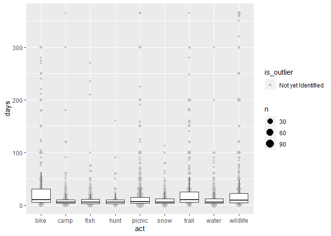

<!-- .md is generated from .Rmd. Please edit that file -->

# Overview

Outliers should be considered with continuous survey variables. There
are no hard and fast rules for outlier identification, but [Tukey’s
Test](https://en.wikipedia.org/wiki/Outlier#Tukey%27s_fences) provides
one method that is easy to apply in a standard way.

## Visualize

Visualizing the data is a first step for examining outliers. To
demonstrate, package sastats includes a survey dataset with annual
participation days for several outdoor recreation activities:

``` r
library(dplyr)
library(sastats)

data(svy)
activities <- svy$act

glimpse(activities)
#> Observations: 11,268
#> Variables: 4
#> $ Vrid <chr> "98", "99", "100", "101", "102", "103", "105", "106", "107", "...
#> $ act  <chr> "trail", "trail", "trail", "trail", "trail", "trail", "trail",...
#> $ part <chr> "Unchecked", "Unchecked", "Unchecked", "Unchecked", "Unchecked...
#> $ days <dbl> NA, NA, NA, NA, NA, NA, NA, NA, 15, 10, NA, 2, NA, NA, 10, NA,...
```

We can use `sastats::outlier_plot()` which is a wrapper for
`ggplot2::geom_boxplot()`. However, the distributions are highly skewed
and difficult to view. Additionally, the postion of the whiskers
suggests that we would be flagging many reasonable values as outliers
(e.g., those above 50 or so for biking).

``` r
outlier_plot(activities, days, act)
```

<!-- -->

An argument is included to allow us to log transform the y-axis. This
makes for more normal distributions, and likely provides a more
reasonable criteria for outlier identification.

``` r
outlier_plot(activities, days, act, apply_log = TRUE)
```

<!-- -->

## Flag Outliers
