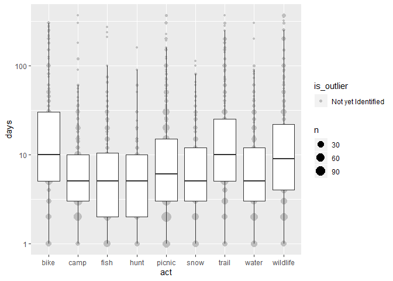
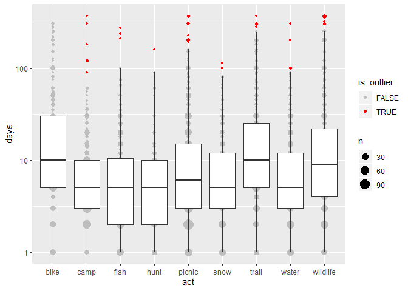

<!-- .md is generated from .Rmd. Please edit that file -->

# Overview

Outliers should be considered when working with continuous survey
variables. There are no hard and fast rules for outlier identification,
but [Tukey’s
Test](https://en.wikipedia.org/wiki/Outlier#Tukey%27s_fences) provides
one method that is easy to apply in a standard way. You can view a
production example for
[B4W-19-01](https://github.com/southwick-associates/B4W-19-01/blob/master/code/svy/7-recode-outliers.R).

#### Example Data

For demonstration, package sastats includes a survey dataset with annual
participation metrics for 9 outdoor recreation activities:

``` r
library(dplyr)
library(sastats)

data(svy) # list with 2 data frames: person, act
activities <- svy$act

glimpse(activities)
#> Observations: 11,268
#> Variables: 4
#> $ Vrid <chr> "98", "99", "100", "101", "102", "103", "105", "106", "107", "...
#> $ act  <chr> "trail", "trail", "trail", "trail", "trail", "trail", "trail",...
#> $ part <chr> "Unchecked", "Unchecked", "Unchecked", "Unchecked", "Unchecked...
#> $ days <dbl> NA, NA, NA, NA, NA, NA, NA, NA, 15, 10, NA, 2, NA, NA, 10, NA,...
```

## Visualize

Visualizing the data is a good first step. We can use
`sastats::outlier_plot()` which is largely a wrapper for
`ggplot2::geom_boxplot()`. The `ignore_zero = TRUE` specification
ensures we exclude any respondents who didn’t actually participate.

``` r
outlier_plot(activities, days, act, ignore_zero = TRUE)
```

<!-- -->

After running this function, we can see that the distributions are
highly skewed and difficult to view. Additionally, the position of the
whiskers suggests that we would be flagging many reasonable values as
outliers (e.g., those above 20 or so for fishing).

Log-transforming the y-axis (`apply_log = TRUE`) produces more normal
distributions, and likely provides a more reasonable criteria for
outlier identification. Note that we don’t need to supply `ignore_zero =
TRUE` since `log(0)` is undefined.

``` r
outlier_plot(activities, days, act, apply_log = TRUE)
```

<!-- -->

## Flag Outliers

We can use `outlier_tukey()` to flag those values observed to be
outliers:

``` r
activities <- activities %>%
    group_by(act) %>% 
    mutate(
        is_outlier = outlier_tukey(days, apply_log = TRUE), 
        days_cleaned = ifelse(is_outlier, NA, days) 
    ) %>% 
    ungroup()

outlier_plot(activities, days, act, apply_log = TRUE, show_outliers = TRUE)
```

<!-- -->

We also have a couple summary functions available to demonstrate the
effects of outlier removal:

``` r
outlier_pct(activities, act)
#> # A tibble: 8 x 4
#> # Groups:   act [8]
#>   act      is_outlier     n pct_outliers
#>   <chr>    <lgl>      <int>        <dbl>
#> 1 camp     TRUE           6       0.479 
#> 2 fish     TRUE           3       0.240 
#> 3 hunt     TRUE           1       0.0799
#> 4 picnic   TRUE          15       1.20  
#> 5 snow     TRUE           2       0.160 
#> 6 trail    TRUE           4       0.319 
#> 7 water    TRUE           4       0.319 
#> 8 wildlife TRUE          13       1.04

outlier_mean_compare(activities, days, days_cleaned, act) 
#> # A tibble: 9 x 3
#>   act       days days_cleaned
#>   <chr>    <dbl>        <dbl>
#> 1 bike     31.6         31.6 
#> 2 camp     11.2          8.58
#> 3 fish     11.6          9.40
#> 4 hunt      9.37         8.34
#> 5 picnic   17.5         13.1 
#> 6 snow      9.99         9.29
#> 7 trail    28.4         25.5 
#> 8 water    12.4         10.5 
#> 9 wildlife 30.5         21.8
```

### Topcode

Instead of removing outliers, we could use `outlier_tukey_top()` to
identify the topcode value and then recode accordingly:

``` r
activities <- activities %>%
    group_by(act) %>%
    mutate(
        topcode_value = outlier_tukey_top(days, apply_log = TRUE),
        days_cleaned = ifelse(is_outlier, topcode_value, days)
    ) %>%
    ungroup()

outlier_mean_compare(activities, days, days_cleaned, act)
#> # A tibble: 9 x 3
#>   act       days days_cleaned
#>   <chr>    <dbl>        <dbl>
#> 1 bike     31.6         31.6 
#> 2 camp     11.2          9.30
#> 3 fish     11.6         10.5 
#> 4 hunt      9.37         9.05
#> 5 picnic   17.5         15.8 
#> 6 snow      9.99         9.91
#> 7 trail    28.4         28.1 
#> 8 water    12.4         11.5 
#> 9 wildlife 30.5         28.6
```
