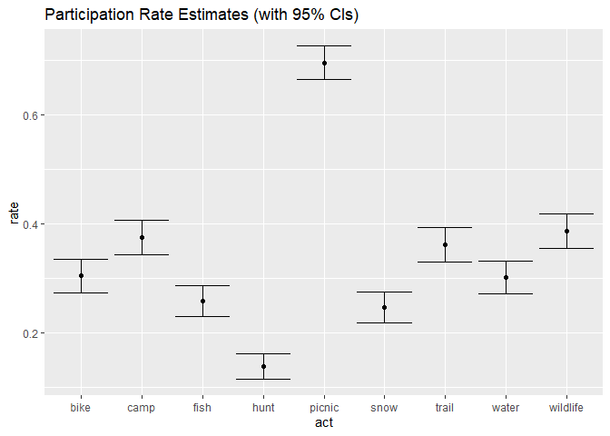
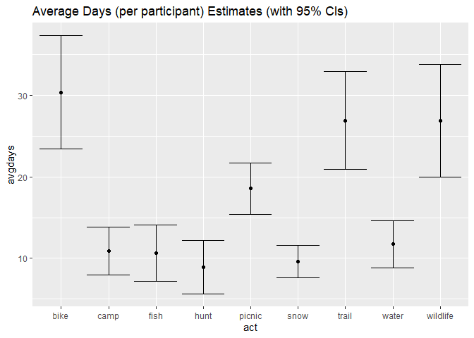

<!-- .md is generated from .Rmd. Please edit that file -->

# Overview

Package sastats includes a few convenience functions for estimating
survey sampling errors. These are simple calculations, and the functions
are just thin wrappers for a bit of code. Relevant measures:

  - Standard error of the mean: `error_se_mean()`
  - Standard error of a proportion: `error_se_prop()`
  - Margin of error (for confidence intervals): `error_me()`

### Notes

[Package
survey](https://cran.r-project.org/web/packages/survey/index.html)
provides a much more comprehensive approach to survey-based calculations
(errors, weighting, etc.). I’ve tended toward the light-weight approach
outlined here, but it could be worth looking into if we are doing alot
of survey analysis in R.

Caculating errors for multi-estimate metrics requires [error
propagation](https://en.wikipedia.org/wiki/Propagation_of_uncertainty)
(e.g., total days which depends on participation rate & average days) .
I haven’t implemented these computations here, but existing packages
address this need. Package
[propagate](https://cran.r-project.org/web/packages/propagate/index.html)
is one I’ve used, but have found tricky to implement. Package
[errors](https://github.com/r-quantities/errors) is newer and appears
more straightforward (although I haven’t tested it).

### Example Data

For demonstration, package sastats includes a survey dataset with annual
participation metrics for 9 outdoor recreation activities:

``` r
library(dplyr)
library(sastats)
data(svy)

activity <- left_join(svy$act, select(svy$person, Vrid, weight), by = "Vrid")
glimpse(activity)
#> Observations: 11,268
#> Variables: 5
#> $ Vrid   <chr> "98", "99", "100", "101", "102", "103", "105", "106", "107",...
#> $ act    <chr> "trail", "trail", "trail", "trail", "trail", "trail", "trail...
#> $ part   <chr> "Unchecked", "Unchecked", "Unchecked", "Unchecked", "Uncheck...
#> $ days   <dbl> NA, NA, NA, NA, NA, NA, NA, NA, 15, 10, NA, 2, NA, NA, 10, N...
#> $ weight <dbl> 0.9596845, 1.0899973, 1.0000000, 0.8747500, 0.9641894, 0.924...
```

## SE Mean

Looking at days of participation:

``` r
days <- activity %>%
    group_by(act) %>% 
    summarise(
        avgdays = weighted.mean(days, weight, na.rm = TRUE),
        se = error_se_mean(days, na.rm = TRUE)
)
days
#> # A tibble: 9 x 3
#>   act      avgdays    se
#>   <chr>      <dbl> <dbl>
#> 1 bike       30.4  2.97 
#> 2 camp       10.9  1.28 
#> 3 fish       10.6  1.49 
#> 4 hunt        8.93 1.41 
#> 5 picnic     18.6  1.35 
#> 6 snow        9.60 0.856
#> 7 trail      26.9  2.58 
#> 8 water      11.8  1.24 
#> 9 wildlife   26.9  2.96
```

## SE Proportion

Looking at participation rate:

``` r
rate <- activity %>%
    group_by(act, part) %>%
    summarise(n = n(), wtn = sum(weight)) %>%
    mutate(
        n = sum(n), 
        rate = wtn / sum(wtn),
        se = error_se_prop(rate, n)
    ) %>%
    filter(part == "Checked")
rate
#> # A tibble: 9 x 6
#> # Groups:   act [9]
#>   act      part        n   wtn  rate      se
#>   <chr>    <chr>   <int> <dbl> <dbl>   <dbl>
#> 1 bike     Checked  1252  381. 0.304 0.0130 
#> 2 camp     Checked  1252  469. 0.375 0.0137 
#> 3 fish     Checked  1252  323. 0.258 0.0124 
#> 4 hunt     Checked  1252  173. 0.138 0.00976
#> 5 picnic   Checked  1252  870. 0.695 0.0130 
#> 6 snow     Checked  1252  309. 0.247 0.0122 
#> 7 trail    Checked  1252  452. 0.361 0.0136 
#> 8 water    Checked  1252  377. 0.301 0.0130 
#> 9 wildlife Checked  1252  484. 0.386 0.0138
```

## Margin of Error

These are useful for reporting confidence intervals. Note that the
dataset weighting produces a “design effect” which inflates the margin
of error. I know the design effect for this dataset, based on the
summary output produced by the `sastats::rake_weight()` procedure.

``` r
deff <- 1.19
rate <- mutate(rate, me = error_me(se) * deff, lower = rate - me, upper = rate + me)
days <- mutate(days, me = error_me(se) * deff, lower = avgdays - me, upper = avgdays + me)

library(ggplot2)
ggplot(rate, aes(act, rate)) +
  geom_point() +
  geom_errorbar(aes(ymin = lower, ymax = upper)) +
  ggtitle("Participation Rate Estimates (with 95% CIs)")
```

<!-- -->

``` r

ggplot(days, aes(act, avgdays)) +
  geom_point() +
  geom_errorbar(aes(ymin = lower, ymax = upper)) +
  ggtitle("Average Days (per participant) Estimates (with 95% CIs)")
```

<!-- -->
